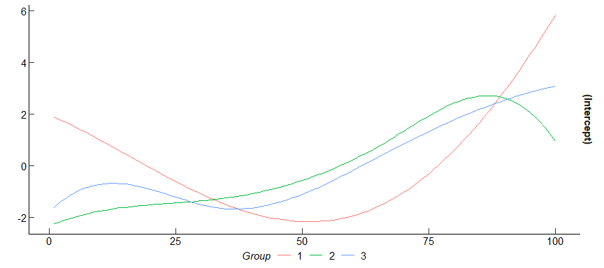

<!-- README.md is generated from README.Rmd. Please edit that file -->

# PAGFL

<!-- badges: start -->

[](https://cran.r-project.org/package=PAGFL)
[](https://cran.r-project.org/package=PAGFL)
[](https://www.gnu.org/licenses/gpl-3.0.html)
[](https://github.com/Paul-Haimerl/PAGFL/actions/workflows/R-CMD-check.yaml)
<!-- badges: end -->

Unobservable group structures are a common challenge in panel data
analysis. Disregarding group-level heterogeneity can introduce bias.
Conversely, estimating individual coefficients for each cross-sectional
unit is inefficient and may lead to high uncertainty.

This package efficiently addresses the issue of unobservable group
structures by implementing the pairwise adaptive group fused Lasso
(*PAGFL*) by Mehrabani
([2023](https://doi.org/10.1016/j.jeconom.2022.12.002)). *PAGFL* is a
regularizer that identifies latent group structures and estimates
group-specific coefficients in a single step. On top of that, we extend
the PAGFL to time-varying functional coefficients.

The `PAGFL` package makes this powerful procedure easy to use. On top of
that, we extend the `PAGFL` to time-varying functional coefficients.

## Installation

You can install the development version of `PAGFL` (1.1.0) from
[GitHub](https://github.com/) with:

``` r
# install.packages('devtools')
devtools::install_github('Paul-Haimerl/PAGFL')
#> farver (2.1.1 -> 2.1.2) [CRAN]
#> package 'farver' successfully unpacked and MD5 sums checked
#> 
#> The downloaded binary packages are in
#>  C:\Users\phaim\AppData\Local\Temp\RtmpQ5Jkuv\downloaded_packages
#> ── R CMD build ─────────────────────────────────────────────────────────────────
#>          checking for file 'C:\Users\phaim\AppData\Local\Temp\RtmpQ5Jkuv\remotesafd947b90174f\Paul-Haimerl-PAGFL-2d18306/DESCRIPTION' ...     checking for file 'C:\Users\phaim\AppData\Local\Temp\RtmpQ5Jkuv\remotesafd947b90174f\Paul-Haimerl-PAGFL-2d18306/DESCRIPTION' ...   ✔  checking for file 'C:\Users\phaim\AppData\Local\Temp\RtmpQ5Jkuv\remotesafd947b90174f\Paul-Haimerl-PAGFL-2d18306/DESCRIPTION' (572ms)
#>       ─  preparing 'PAGFL':
#>    checking DESCRIPTION meta-information ...  ✔  checking DESCRIPTION meta-information
#> ─  cleaning src
#>       ─  checking for LF line-endings in source and make files and shell scripts (534ms)
#>   ─  checking for empty or unneeded directories
#>        NB: this package now depends on R (>= 3.5.0)
#>      WARNING: Added dependency on R >= 3.5.0 because serialized objects in
#>      serialize/load version 3 cannot be read in older versions of R.
#>      File(s) containing such objects:
#>        'PAGFL/tests/testthat/fixtures/pagfl_pgmm_resid.rds'
#>        'PAGFL/tests/testthat/fixtures/pagfl_pgmm_sim.rds'
#>        'PAGFL/tests/testthat/fixtures/pagfl_pls_resid.rds'
#>        'PAGFL/tests/testthat/fixtures/pagfl_pls_sim.rds'
#>        'PAGFL/tests/testthat/fixtures/tv_pagfl_resid.rds'
#>        'PAGFL/tests/testthat/fixtures/tv_pagfl_sim.rds'
#>        'PAGFL/tests/testthat/fixtures/tv_pagfl_sim_2.rds'
#> ─  building 'PAGFL_1.1.0.tar.gz'
#>      
#> 
library(PAGFL)
```

The stable version (1.0.1) is available on CRAN:

    install.packages("PAGFL")

## Data

The `PAGFL` packages includes a function that automatically simulates a
panel with a group structure:

``` r
# Simulate a simple panel with three distinct groups and two exogenous explanatory variables
set.seed(1)
sim <- sim_DGP(N = 20, n_periods = 150, p = 2, n_groups = 3)
y <- sim$y
X <- sim$X
```

$$y_{it} = \beta_i^\prime x_{it} + \eta_i + u_{it}, \quad i = 1, \dots, N, \quad t = 1, \dots, T,$$
where $y_{it}$ is a scalar dependent variable, $x_{it}$ a $p \times 1$
vector of explanatory variables, and $\eta_i$ reflects a fixed effect.
The slope coefficients are subject to the group structure

$$\beta_{i} = \sum_{k = 1}^K \alpha_k \boldsymbol{1} \{i \in G_k \},$$
with $\cup_{k = 1}^K G_k = \{1, \dots, N \}$, and
$G_k \cap G_j = \emptyset$ as well as $|| \alpha_k \neq \alpha_j ||$ for
any $k \neq j$, $k,j = 1, \dots, K$ (see Mehrabani
[2023](https://doi.org/10.1016/j.jeconom.2022.12.002), sec. 2).

`sim_DGP` also nests, among other, all DGPs employed in the simulation
study of Mehrabani
([2023](https://doi.org/10.1016/j.jeconom.2022.12.002), sec. 6). I refer
to the documentation of `sim_DGP` or Mehrabani
([2023](https://doi.org/10.1016/j.jeconom.2022.12.002), sec. 6) for more
details.

## Applying PAGFL

To execute the PAGFL procedure, simply pass the dependent and
independent variables, the number of time periods, and a penalization
parameter $\lambda$.

``` r
estim <- pagfl(y ~ X, n_periods = 150, lambda = 10)
summary(estim)
#> Call:
#> pagfl(formula = y ~ X, n_periods = 150, lambda = 10)
#> 
#> Balanced panel: N = 20, T = 150, obs = 3000
#> 
#> Convergence reached:
#> TRUE (48 iterations)
#> 
#> Information criterion:
#>        IC    lambda 
#>  1.369653 10.000000 
#> 
#> Residuals:
#>      Min       1Q   Median       3Q      Max 
#> -3.84943 -0.74149 -0.01570  0.78188  4.80284 
#> 
#> 2 groups:
#>  1  2  3  4  5  6  7  8  9 10 11 12 13 14 15 16 17 18 19 20 
#>  1  1  2  1  1  1  1  2  1  1  2  2  2  1  1  1  1  1  2  1 
#> 
#> Coefficients:
#>                X1       X2
#> Group 1 -0.30939  1.60784
#> Group 2 -0.51484 -1.16445
#> 
#> Residual standard error: 1.15695 on 2978 degrees of freedom
#> Mean squared error 1.32872
#> Multiple R-squared: 0.64641, Adjusted R-squared: 0.64392
```

`pagfl()` returns an object of type `pagfl` which holds

1.  `model`: A `data.frame` containing the dependent and explanatory
    variables as well as individual and time indices (if provided).
2.  `coefficients`: A $K \times p$ matrix of the post-Lasso
    group-specific parameter estimates.
3.  `groups`: A `list` containing (i) the total number of groups
    $\hat{K}$ and (ii) a vector of estimated group memberships
    $(\hat{g}_1, \dots, \hat{g}_N)$, where $\hat{g}_i = k$ if $i$ is
    assigned to group $k$.
4.  `residuals`: A vector of residuals of the demeaned model.
5.  `fitted`: A vector of fitted values of the demeaned model.
6.  `args`: A list of additional arguments.
7.  `IC`: A `list` containing (i) the value of the IC, (ii) the employed
    tuning parameter $\lambda$, and (iii) the mean squared error.
8.  `convergence`: A `list` containing (i) a logical variable if
    convergence was achieved and (ii) the number of executed *ADMM*
    algorithm iterations.
9.  `call`: The function call.

Furthermore, `pagfl` objects can be used in a variety of useful generic
methods like `summary()`, `fitted()`, `resid()`, `df.residual`,
`formula`, and `coef()`.

``` r
estim_fit <- fitted(estim)
```


Selecting a $\lambda$ value a priori can be tricky. For instance, it
seems like `lambda = 10` is too high since the number of groups $K$ is
underestimated. As a consequence, we suggest iterating over a
comprehensive range of candidate values. To specify a suitable grid,
create a logarithmic sequence ranging from 0 to a penalty parameter that
induces an entirely homogeneous model (i.e., $\widehat{K} = 1$). The
resulting $\lambda$ grid vector can be passed in place of any specific
value, and a BIC IC selects the best-fitting parameter.

Moreover, if the explanatory variables in `X` are named, those names
also appear in the output.

``` r
colnames(X) <- c("a", "b")
data <- cbind(y = c(y), X)

lambda_set <- exp(log(10) * seq(log10(1e-4), log10(10), length.out = 10))
estim_set <- pagfl(y ~ a + b, data = data, n_periods = 150, lambda = lambda_set)
summary(estim_set)
#> Call:
#> pagfl(formula = y ~ a + b, data = data, n_periods = 150, lambda = lambda_set)
#> 
#> Balanced panel: N = 20, T = 150, obs = 3000
#> 
#> Convergence reached:
#> TRUE (49 iterations)
#> 
#> Information criterion:
#>         IC     lambda 
#> 1.12938906 0.05994843 
#> 
#> Residuals:
#>      Min       1Q   Median       3Q      Max 
#> -3.43373 -0.65970 -0.01794  0.72318  3.79962 
#> 
#> 3 groups:
#>  1  2  3  4  5  6  7  8  9 10 11 12 13 14 15 16 17 18 19 20 
#>  1  1  2  3  1  3  3  2  3  3  2  2  2  1  1  1  3  1  2  3 
#> 
#> Coefficients:
#>                 a        b
#> Group 1 -0.90820  1.65921
#> Group 2 -0.51484 -1.16445
#> Group 3  0.30230  1.56543
#> 
#> Residual standard error: 1.03725 on 2978 degrees of freedom
#> Mean squared error 1.068
#> Multiple R-squared: 0.71579, Adjusted R-squared: 0.71379
```

When, as above, the specific estimation method is left unspecified,
`pagfl` defaults to penalized Least Squares (*PLS*) `method = 'PLS'`
(Mehrabani, [2023](https://doi.org/10.1016/j.jeconom.2022.12.002),
sec. 2.2). *PLS* is very efficient but requires weakly exogenous
regressors. However, even endogenous predictors can be accounted for by
employing a penalized Generalized Method of Moments (*PGMM*) routine in
combination with exogenous instruments $\boldsymbol{Z}$.

Specify a slightly more elaborate endogenous and dynamic panel data set
and apply *PGMM*. When encountering a dynamic panel data set, we
recommend using a Jackknife bias correction, as proposed by Dhaene and
Jochmans ([2015](https://doi.org/10.1093/restud/rdv007)).

``` r
# Generate a panel where the predictors X correlate with the cross-sectional innovation, 
# but can be instrumented with q = 3 variables in Z. Furthermore, include GARCH(1,1) 
# innovations, an AR lag of the dependent variable, and specific group sizes
sim_endo <- sim_DGP(N = 50, n_periods = 150, p = 2, n_groups = 3, group_proportions = c(0.2, 0.2, 0.6), 
error_spec = 'GARCH', q = 3)
y_endo <- sim_endo$y
X_endo <- sim_endo$X
Z <- sim_endo$Z

# Note that the method PGMM and the instrument matrix Z needs to be passed
estim_endo <- pagfl(y_endo ~ X_endo, n_periods = 150, lambda = 0.05, method = 'PGMM', Z = Z, bias_correc = TRUE, max_iter = 8e3)
summary(estim_endo)
#> Call:
#> pagfl(formula = y_endo ~ X_endo, n_periods = 150, lambda = 0.05, 
#>     method = "PGMM", Z = Z, bias_correc = TRUE, max_iter = 8000)
#> 
#> Balanced panel: N = 50, T = 150, obs = 7450
#> 
#> Convergence reached:
#> FALSE (8000 iterations)
#> 
#> Information criterion:
#>       IC   lambda 
#> 1.844708 0.050000 
#> 
#> Residuals:
#>      Min       1Q   Median       3Q      Max 
#> -4.62981 -0.88029  0.00097  0.89209  5.38628 
#> 
#> 3 groups:
#>  1  2  3  4  5  6  7  8  9 10 11 12 13 14 15 16 17 18 19 20 21 22 23 24 25 26 
#>  1  2  3  1  2  1  3  2  2  3  3  1  1  1  2  1  1  1  1  1  1  1  3  1  1  1 
#> 27 28 29 30 31 32 33 34 35 36 37 38 39 40 41 42 43 44 45 46 47 48 49 50 
#>  3  2  2  1  1  2  3  1  3  1  2  2  1  1  3  1  1  1  1  1  1  1  1  3 
#> 
#> Coefficients:
#>                X1       X2
#> Group 1 -0.63567 -0.90973
#> Group 2 -0.48163  1.34957
#> Group 3  1.30702 -2.01686
#> 
#> Residual standard error: 1.34688 on 7398 degrees of freedom
#> Mean squared error 1.80144
#> Multiple R-squared: 0.84243, Adjusted R-squared: 0.84134
```

Furthermore, `pagfl` lets you select a minimum group size, adjust the
efficiency vs. accuracy trade-off of the iterative estimation algorithm,
and modify a list of further settings. Visit the documentation
`?pagfl()` for more information.

## The Time-varying PAGFL

The development version of the package also includes the functions
`sim_tv_DGP()`and `tv_pagfl()`, which generate and estimate a grouped
panel data models with the time-varying coefficients
$\beta_{it} = \beta_i \left( \frac{t}{T} \right)$. Just like in the
static case, the functional coefficients admit to a group structure
$\beta_{it} = \sum_{k = 1}^K \alpha_k \left( \frac{t}{T} \right) 1 \{i \in G_k \}$.
Following Su et
al. ([2019](https://doi.org/10.1080/07350015.2017.1340299)), the
time-varying coefficients are estimated using polynomial B-spline
functions employing a penalized sieve estimation (*PSE*).

``` r
# Simulate a time-varying panel with a trend and a group pattern
N <- 20
n_periods <- 100
tv_sim <- sim_tv_DGP(N = N, n_periods = n_periods, sd_error = 1, intercept = TRUE, p = 0)
y <- tv_sim$y
X <- tv_sim$X

tv_estim <- tv_pagfl(y ~ 1 + X, n_periods = 100, lambda = 8)
summary(tv_estim)
#> Call:
#> tv_pagfl(formula = y ~ 1 + X, n_periods = 100, lambda = 8)
#> 
#> Balanced panel: N = 20, T = 100, obs = 2000
#> 
#> Convergence reached:
#> TRUE (1021 iterations)
#> 
#> Information criterion:
#>      IC  lambda 
#> 1.18797 8.00000 
#> 
#> Residuals:
#>      Min       1Q   Median       3Q      Max 
#> -3.76481 -0.63770 -0.00388  0.65288  4.20256 
#> 
#> 3 groups:
#>  1  2  3  4  5  6  7  8  9 10 11 12 13 14 15 16 17 18 19 20 
#>  1  1  2  2  1  2  1  2  2  1  2  1  2  2  3  2  2  1  3  2 
#> 
#> Residual standard error: 1.0116 on 1973 degrees of freedom
#> Mean squared error 1.00951
#> Multiple R-squared: 0.77166, Adjusted R-squared: 0.76865
```


`tv_pagfl()` returns an object of class `tvpagfl` which contains

1.  `model`: A `data.frame` containing the dependent and explanatory
    variables as well as individual and time indices (if provided).
2.  `coefficients`: A list holding (i) a
    $T \times p^{(1)} \times \hat{K}$ array of the post-Lasso
    group-specific functional coefficients and (ii) a $K \times p^{(2)}$
    matrix of time-constant parameter estimates (when running a mixed
    time-varying panel data model).
3.  `groups`: A `list` containing (i) the total number of groups
    $\hat{K}$ and (ii) a vector of estimated group memberships
    $(\hat{g}_1, \dots, \hat{g}_N)$, where $\hat{g}_i = k$ if $i$ is
    assigned to group $k$.
4.  `residuals`: A vector of residuals of the demeaned model.
5.  `fitted`: A vector of fitted values of the demeaned model.
6.  `args`: A list of additional arguments.
7.  `IC`: A `list` containing (i) the value of the IC, (ii) the employed
    tuning parameter $\lambda$, and (iii) the mean squared error.
8.  `convergence`: A `list` containing (i) a logical variable if
    convergence was achieved and (ii) the number of executed *ADMM*
    algorithm iterations.
9.  `call`: The function call.

Again, `tvpagfl` objects have generic `summary()`, `fitted()`,
`resid()`, `df.residual`, `formula`, and `coef()` methods.

In empirical applications, it is commonplace to encounter unbalanced
panel data sets. In such instances, time-varying coefficient functions
can be estimated nonetheless. The nonparametric spline functions simply
interpolate missing periods. However, when using unbalanced datasets it
is required to provide explicit indicator variables that declare the
cross-sectional individual and time period each observation belongs to.

Lets delete 30% of observations, add indicator variables, and run
`tv_pagfl()` again.

``` r
# Draw some observations to be omitted
delete_index <- as.logical(rbinom(n = N * n_periods, prob = 0.7, size = 1))
# Construct cross-sectional and time indicator variables
i_index <- rep(1:N, each = n_periods)
t_index <- rep(1:n_periods, N)
data <- cbind(y = c(y), i_index = i_index, t_index = t_index)
# Delete some observations and create a named data.frame
data <- data[delete_index,]
# Apply the time-varying PAGFL to an unbalanced panel
tv_estim_unbalanced <- tv_pagfl(y ~ 1, data = data, index = c("i_index", "t_index"), lambda = 8)
summary(tv_estim_unbalanced)
#> Call:
#> tv_pagfl(formula = y ~ 1, data = data, index = c("i_index", "t_index"), 
#>     lambda = 8)
#> 
#> Unbalanced panel: N = 20, T = 57-79, obs = 1424
#> 
#> Convergence reached:
#> TRUE (402 iterations)
#> 
#> Information criterion:
#>      IC  lambda 
#> 1.15543 8.00000 
#> 
#> Residuals:
#>      Min       1Q   Median       3Q      Max 
#> -3.75275 -0.65157 -0.01055  0.66519  3.61407 
#> 
#> 2 groups:
#>  1  2  3  4  5  6  7  8  9 10 11 12 13 14 15 16 17 18 19 20 
#>  1  1  2  2  1  2  1  2  2  1  2  1  2  2  1  2  2  1  1  2 
#> 
#> Residual standard error: 1.02785 on 1397 degrees of freedom
#> Mean squared error 1.03645
#> Multiple R-squared: 0.75995, Adjusted R-squared: 0.75549
```



Furthermore, `tv_pagfl` lets you specify a lot more optionalities than
shown here. For example, it is possible to adjust the polyomial degree
and the number of interior knots in the spline basis system, or estimate
a panel data model with a mix of time-varying and time-constant
coefficients. See `?tv_pagfl()` for details.

## References

- Dhaene, G., & Jochmans, K. (2015). Split-panel jackknife estimation of
  fixed-effect models. *The Review of Economic Studies*, 82(3),
  991-1030. DOI:
  [10.1093/restud/rdv007](https://doi.org/10.1093/restud/rdv007)

- Mehrabani, A. (2023). Estimation and identification of latent group
  structures in panel data. *Journal of Econometrics*, 235(2),
  1464-1482. DOI:
  [10.1016/j.jeconom.2022.12.002](https://doi.org/10.1016/j.jeconom.2022.12.002)

- Schumaker, L. (2007). Spline functions: basic theory. *Cambridge
  university press*. DOI:
  [10.1017/CBO9780511618994](https://doi.org/10.1017/CBO9780511618994)

- Su, L., Wang, X., & Jin, S. (2019). Sieve estimation of time-varying
  panel data models with latent structures. *Journal of Business &
  Economic Statistics*, 37(2), 334-349. DOI:
  [10.1080/07350015.2017.1340299](https://doi.org/10.1080/07350015.2017.1340299)
