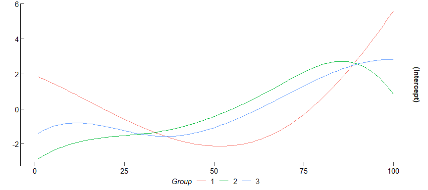

<!-- README.md is generated from README.Rmd. Please edit that file -->

# PAGFL 

<!-- badges: start -->

[](https://cran.r-project.org/package=PAGFL)
[](https://cran.r-project.org/package=PAGFL)
[](https://www.gnu.org/licenses/agpl-3.0.html)
[](https://github.com/Paul-Haimerl/PAGFL/actions/workflows/R-CMD-check.yaml)
[](https://app.codecov.io/gh/Paul-Haimerl/PAGFL)

<!-- badges: end -->

Unobservable group structures are a common challenge in panel data
analysis. Disregarding group-level heterogeneity can introduce bias.
Conversely, estimating individual coefficients for each cross-sectional
unit is inefficient and may lead to high uncertainty. Furthermore,
neglecting time-variance in slope coefficients can lead to inconsistent
and misleading results, even in large panels.

This package efficiently addresses these issues by implementing the
pairwise adaptive group fused Lasso (*PAGFL*) by Mehrabani
([2023](https://doi.org/10.1016/j.jeconom.2022.12.002)) and
*FUSE-TIME*–Fused Unobserved group Spline Estimation–by Haimerl et
al. ([2025](https://doi.org/10.48550/arXiv.2503.23165)). *PAGFL* is a
regularizer that identifies latent group structures and estimates
group-specific coefficients in a single step. *FUSE-TIME* generalizes
this to smoothly time-varying coefficients.

The `PAGFL` package makes these powerful procedures easy to use.

## Installation

Always stay up-to-date with the development version (1.1.4) of `PAGFL`
from [GitHub](https://github.com/):

``` r
# install.packages("devtools")
devtools::install_github("Paul-Haimerl/PAGFL")
library(PAGFL)
```

The stable version (1.1.4) is available on CRAN:

    install.packages("PAGFL")

## Data

The `PAGFL` package includes a function that automatically simulates a
panel data set with a group structure in the slope coefficients:

``` r
# Simulate a simple panel with three distinct groups and two exogenous explanatory variables
set.seed(1)
sim <- sim_DGP(N = 20, n_periods = 150, p = 2, n_groups = 3)
data <- sim$data
```

$$y_{it} = \beta_i^{0 \prime} x_{it} + \gamma_i + u_{it}, \quad i = 1, \dots, N, \quad t = 1, \dots, T,$$

where $y_{it}$ is a scalar dependent variable, $x_{it}$ a $p \times 1$
vector of explanatory variables, and $\gamma_i$ reflects an individual
fixed effect. The $p$-dimensional vector slope coefficients $\beta_i^0$
follows the (latent) group structure

$$\beta_{i} = \sum_{k = 1}^K \alpha_k 1 \{i \in G_k \},$$

with $\cup_{k = 1}^K G_k = \{1, \dots, N \}$, and
$G_k \cap G_j = \emptyset$ as well as $\| \alpha_k \neq \alpha_j \|$ for
any $k \neq j$, $k,j = 1, \dots, K$ (see Mehrabani
[2023](https://doi.org/10.1016/j.jeconom.2022.12.002), sec. 2).

`sim_DGP()` also nests, among other, all DGPs employed in the simulation
study of Mehrabani
([2023](https://doi.org/10.1016/j.jeconom.2022.12.002), sec. 6).

## Applying PAGFL

To execute the PAGFL procedure, pass the dependent and independent
variables, the number of time periods, and a penalization parameter
$\lambda$.

``` r
estim <- pagfl(y ~ ., data = data, n_periods = 150, lambda = 20, verbose = F)
summary(estim)
#> Call:
#> pagfl(formula = y ~ ., data = data, n_periods = 150, lambda = 20, 
#>     verbose = F)
#> 
#> Balanced panel: N = 20, T = 150, obs = 3000
#> 
#> Convergence reached:
#> TRUE (49 iterations)
#> 
#> Information criterion:
#>     IC lambda 
#>  1.354 20.000 
#> 
#> Residuals:
#>      Min       1Q   Median       3Q      Max 
#> -4.47230 -0.72086 -0.00120  0.76214  4.31838 
#> 
#> 2 groups:
#>  1  2  3  4  5  6  7  8  9 10 11 12 13 14 15 16 17 18 19 20 
#>  1  1  2  1  1  1  1  2  1  1  2  2  2  1  1  1  1  1  2  1 
#> 
#> Coefficients:
#>                X1       X2
#> Group 1 -0.36838  1.61275
#> Group 2 -0.49489 -1.23534
#> 
#> Residual standard error: 1.15012 on 2978 degrees of freedom
#> Mean squared error: 1.31307
#> Multiple R-squared: 0.65845, Adjusted R-squared: 0.65605
```

`pagfl()` returns an object of type `pagfl`, which holds

1.  `model`: A `data.frame` containing the dependent and explanatory
    variables as well as individual and time indices (if provided).
2.  `coefficients`: A $K \times p$ matrix of the post-Lasso
    group-specific parameter estimates.
3.  `groups`: A `list` containing (i) the total number of groups
    $\hat{K}$ and (ii) a vector of estimated group memberships
    $(\hat{g}_1, \dots, \hat{g}_N)$, where $\hat{g}_i = k$ if $i$ is
    assigned to group $k$.
4.  `residuals`: A vector of residuals of the demeaned model.
5.  `fitted`: A vector of fitted values of the demeaned model.
6.  `args`: A list of additional arguments.
7.  `IC`: A `list` containing (i) the value of the IC, (ii) the employed
    tuning parameter $\lambda$, and (iii) the mean squared error.
8.  `convergence`: A `list` containing (i) a logical variable if
    convergence was achieved and (ii) the number of executed *ADMM*
    algorithm iterations.
9.  `call`: The function call.

> [!TIP] 
> `pagfl` objects support a variety of useful generic functions like `summary()`, `fitted()`, `resid()`, `df.residual`, `formula`, and `coef()`.

``` r
estim_fit <- fitted(estim)
```

<!-- -->

> [!IMPORTANT] 
> Selecting a $\lambda$ value a priori can be tricky. For instance, it seems like `lambda = 20` is too high since the number of groups $K$ is underestimated.

We suggest iterating over a comprehensive range of candidate values to
trace out the correct model. To specify a suitable grid, create a
logarithmic sequence ranging from a penalty parameter that induces
complete slope heterogeneity to complete slope homogeneity (i.e.,
$\widehat{K} = 1$). The resulting $\lambda$ grid vector can be passed in
place of any specific value, and a BIC IC selects the best-fitting
parameter.

Furthermore, it is also possible to supply a `data.frame` with named
variables and choose a specific formula that selects the variables in
that `data.frame`, just like in the base `lm()` function. If the
explanatory variables in `X` are named, these names also appear in the
output.

``` r
colnames(data)[-1] <- c("a", "b")

lambda_set <- exp(log(10) * seq(log10(1e-4), log10(10), length.out = 10))
estim_set <- pagfl(y ~ a + b, data = data, n_periods = 150, lambda = lambda_set, verbose = F)
summary(estim_set)
#> Call:
#> pagfl(formula = y ~ a + b, data = data, n_periods = 150, lambda = lambda_set, 
#>     verbose = F)
#> 
#> Balanced panel: N = 20, T = 150, obs = 3000
#> 
#> Convergence reached:
#> TRUE (51 iterations)
#> 
#> Information criterion:
#>      IC  lambda 
#> 1.12877 0.21544 
#> 
#> Residuals:
#>      Min       1Q   Median       3Q      Max 
#> -3.47858 -0.66283 -0.02688  0.72880  3.77812 
#> 
#> 3 groups:
#>  1  2  3  4  5  6  7  8  9 10 11 12 13 14 15 16 17 18 19 20 
#>  1  1  2  3  1  3  3  2  3  3  2  2  2  1  1  1  3  1  2  3 
#> 
#> Coefficients:
#>                 a        b
#> Group 1 -0.95114  1.61719
#> Group 2 -0.49489 -1.23534
#> Group 3  0.24172  1.61613
#> 
#> Residual standard error: 1.03695 on 2978 degrees of freedom
#> Mean squared error: 1.06738
#> Multiple R-squared: 0.72236, Adjusted R-squared: 0.7204
```

When, as above, the specific estimation method is left unspecified,
`pagfl()` defaults to penalized Least Squares (*PLS*) `method = 'PLS'`
(Mehrabani, [2023](https://doi.org/10.1016/j.jeconom.2022.12.002),
sec. 2.2). *PLS* is very efficient but requires weakly exogenous
regressors. However, even endogenous predictors can be accounted for by
employing a penalized Generalized Method of Moments (*PGMM*) routine in
combination with exogenous instruments $Z$.

Specify a slightly more elaborate endogenous and dynamic panel data set
and apply *PGMM*. When encountering a dynamic panel data set, we
recommend using a Jackknife bias correction, as proposed by Dhaene and
Jochmans ([2015](https://doi.org/10.1093/restud/rdv007)).

``` r
# Generate a panel where the predictors X correlate with the cross-sectional innovation,
# but can be instrumented with q = 2 variables in Z. Furthermore, include GARCH(1,1)
# innovations, and specific group sizes
sim_endo <- sim_DGP(
  N = 20, n_periods = 200, p = 2, n_groups = 3, group_proportions = c(0.3, 0.3, 0.4),
  error_spec = "GARCH", q = 2
)
data_endo <- sim_endo$data
Z <- sim_endo$Z

# Note that the method PGMM and the instrument matrix Z need to be passed
estim_endo <- pagfl(y ~ ., data = data_endo, n_periods = 200, lambda = 2, method = "PGMM", Z = Z, bias_correc = TRUE, max_iter = 50e3, verbose = FALSE)
summary(estim_endo)
#> Call:
#> pagfl(formula = y ~ ., data = data_endo, n_periods = 200, lambda = 2, 
#>     method = "PGMM", Z = Z, bias_correc = TRUE, max_iter = 50000, 
#>     verbose = FALSE)
#> 
#> Balanced panel: N = 20, T = 200, obs = 3980
#> 
#> Convergence reached:
#> TRUE (14632 iterations)
#> 
#> Information criterion:
#>      IC  lambda 
#> 1.97129 2.00000 
#> 
#> Residuals:
#>      Min       1Q   Median       3Q      Max 
#> -4.87011 -0.90055  0.01193  0.90767  5.54203 
#> 
#> 3 groups:
#>  1  2  3  4  5  6  7  8  9 10 11 12 13 14 15 16 17 18 19 20 
#>  1  2  3  3  3  2  2  3  1  3  2  2  1  1  2  1  3  1  3  3 
#> 
#> Coefficients:
#>                X1       X2
#> Group 1  0.55337 -1.22836
#> Group 2 -0.88484 -0.89231
#> Group 3  1.60547 -1.43718
#> 
#> Residual standard error: 1.38812 on 3958 degrees of freedom
#> Mean squared error: 1.91621
#> Multiple R-squared: 0.87079, Adjusted R-squared: 0.8701
```

> [!TIP] 
> `pagfl()` lets you select a minimum group size, adjust the efficiency vs. accuracy trade-off of the iterative estimation algorithm, and modify a list of further settings. Visit the documentation `?pagfl()` for more information.

## FUSE-TIME

The package also includes the functions `sim_tv_DGP()` and
`fuse_time()`, which generate and estimate grouped panel data models
with smoothly time-varying coefficients $\beta_i (t/T)$. As detailed in
Haimerl et al. ([2025](https://doi.org/10.48550/arXiv.2503.23165)), the
functional coefficients admit to the group structure

$$\beta_{i} (t/T) = \sum_{k = 1}^K \alpha_k (t/T) \mathbb{1} \{i \in G_k \}.$$

The time-varying coefficients are estimated using polynomial B-spline
functions, yielding a penalized sieve estimator (*PSE*) (see [Haimerl et
al., 2025](https://doi.org/10.48550/arXiv.2503.23165), sec. 2).

``` r
# Simulate a time-varying panel with a trend and a group pattern
N <- 20
n_periods <- 100
tv_sim <- sim_tv_DGP(N = N, n_periods = n_periods, sd_error = 1, intercept = TRUE, p = 1)
tv_data <- tv_sim$data

tv_estim <- fuse_time(y ~ 1, data = tv_data, n_periods = n_periods, lambda = 5, verbose = F)
summary(tv_estim)
#> Call:
#> fuse_time(formula = y ~ 1, data = tv_data, n_periods = n_periods, 
#>     lambda = 5, verbose = F)
#> 
#> Balanced panel: N = 20, T = 100, obs = 2000
#> 
#> Convergence reached:
#> TRUE (212 iterations)
#> 
#> Information criterion:
#>      IC  lambda 
#> 0.16648 5.00000 
#> 
#> Residuals:
#>      Min       1Q   Median       3Q      Max 
#> -3.57761 -0.68826  0.00820  0.70118  3.40708 
#> 
#> 3 groups:
#>  1  2  3  4  5  6  7  8  9 10 11 12 13 14 15 16 17 18 19 20 
#>  1  1  1  2  2  2  1  3  3  3  2  2  3  1  3  1  2  3  2  3 
#> 
#> Residual standard error: 1.02901 on 1974 degrees of freedom
#> Mean squared error: 1.04509
#> Multiple R-squared: 0.74213, Adjusted R-squared: 0.73886
```

<!-- -->

`fuse_time()` returns an object of class `fusetime`, which contains

1.  `model`: A `data.frame` containing the dependent and explanatory
    variables as well as individual and time indices (if provided).
2.  `coefficients`: A list holding (i) a
    $T \times p^{(1)} \times \hat{K}$ array of the post-Lasso
    group-specific functional coefficients and (ii) a $K \times p^{(2)}$
    matrix of time-constant parameter estimates (when running a mixed
    time-varying panel data model).
3.  `groups`: A `list` containing (i) the total number of groups
    $\hat{K}$ and (ii) a vector of estimated group memberships
    $(\hat{g}_1, \dots, \hat{g}_N)$, where $\hat{g}_i = k$ if $i$ is
    assigned to group $k$.
4.  `residuals`: A vector of residuals of the demeaned model.
5.  `fitted`: A vector of fitted values of the demeaned model.
6.  `args`: A list of additional arguments.
7.  `IC`: A `list` containing (i) the value of the IC, (ii) the employed
    tuning parameter $\lambda$, and (iii) the mean squared error.
8.  `convergence`: A `list` containing (i) a logical variable if
    convergence was achieved and (ii) the number of executed *ADMM*
    algorithm iterations.
9.  `call`: The function call.

> [!TIP] 
> Again, `fusetime` objects support generic `summary()`,  `fitted()`, `resid()`, `df.residual`, `formula`, and `coef()` functions.

In empirical settings, unbalanced panel datasets are common;
nevertheless, time-varying coefficient functions remain identifiable
(see Haimerl et al. [2025](https://doi.org/10.48550/arXiv.2503.23165),
Appendix D). The spline functions simply interpolate missing time
periods and the group structure compensates for missings in any
individual cross-sectional unit. However, when using unbalanced datasets
it is required to provide explicit indicator variables that declare the
cross-sectional individual and time period each observation belongs to.

Lets delete 30% of observations, add indicator variables, and run
`fuse_time()` again.

``` r
# Draw some observations to be omitted
delete_index <- as.logical(rbinom(n = N * n_periods, prob = 0.7, size = 1))
# Construct cross-sectional and time indicator variables
tv_data$i_index <- rep(1:N, each = n_periods)
tv_data$t_index <- rep(1:n_periods, N)
# Delete some observations
tv_data <- tv_data[delete_index, ]
# Apply the time-varying PAGFL to an unbalanced panel
tv_estim_unbalanced <- fuse_time(y ~ 1, data = tv_data, index = c("i_index", "t_index"), lambda = 5, verbose = F)
summary(tv_estim_unbalanced)
#> Call:
#> fuse_time(formula = y ~ 1, data = tv_data, index = c("i_index", 
#>     "t_index"), lambda = 5, verbose = F)
#> 
#> Unbalanced panel: N = 20, T = 64-75, obs = 1379
#> 
#> Convergence reached:
#> TRUE (950 iterations)
#> 
#> Information criterion:
#>      IC  lambda 
#> 0.18921 5.00000 
#> 
#> Residuals:
#>      Min       1Q   Median       3Q      Max 
#> -3.43491 -0.69055 -0.00812  0.68488  3.63894 
#> 
#> 3 groups:
#>  1  2  3  4  5  6  7  8  9 10 11 12 13 14 15 16 17 18 19 20 
#>  1  1  1  2  2  2  1  2  3  3  2  2  3  1  3  1  2  3  2  2 
#> 
#> Residual standard error: 1.04387 on 1353 degrees of freedom
#> Mean squared error: 1.06912
#> Multiple R-squared: 0.73683, Adjusted R-squared: 0.73197
```

<!-- -->

> [!TIP] 
> `fuse_time()` lets you specify a lot more optionalities than shown here. For example, it is possible to adjust the polynomial degree and the number of interior knots in the spline basis system, or estimate a panel data model with a mix of time-varying and time-constant coefficients. See `?fuse_time()` for details.

## Observing a Group Structure

It may occur that the group structure is known and does not need to be
estimated. In such instances, `grouped_plm()` and `grouped_tv_plm()`
make it easy to estimate a (time-varying) linear panel data model given
an observed grouping.

``` r
groups <- sim$groups
estim_oracle <- grouped_plm(y ~ ., data = data, n_periods = 150, groups = groups, method = "PLS")
summary(estim_oracle)
#> Call:
#> grouped_plm(formula = y ~ ., data = data, groups = groups, n_periods = 150, 
#>     method = "PLS")
#> 
#> Balanced panel: N = 20, T = 150, obs = 3000
#> 
#> Information criterion: 1.12877 
#> 
#> Residuals:
#>      Min       1Q   Median       3Q      Max 
#> -3.47858 -0.66283 -0.02688  0.72880  3.77812 
#> 
#> 3 groups:
#>  1  2  3  4  5  6  7  8  9 10 11 12 13 14 15 16 17 18 19 20 
#>  1  1  2  3  1  3  3  2  3  3  2  2  2  1  1  1  3  1  2  3 
#> 
#> Coefficients:
#>                 a        b
#> Group 1 -0.95114  1.61719
#> Group 2 -0.49489 -1.23534
#> Group 3  0.24172  1.61613
#> 
#> Residual standard error: 1.03695 on 2978 degrees of freedom
#> Mean squared error: 1.06738
#> Multiple R-squared: 0.72236, Adjusted R-squared: 0.7204
```

Besides not estimating the group structure, `grouped_plm()`
(`grouped_tv_plm()`) behave identically to `pagfl()` (`fuse_time()`)

## Future Outlook

The package is still under active development. Future versions are
planned to include

- Global coefficients
- Un-penalized individual coefficients
- Inference methods

You are not a R-user? Worry not - An equivalent Python library is in the
works.

Feel free to [reach out](mailto:paul.haimerl@econ.au.dk) if you have any
suggestions or questions.

## References

Dhaene, G., & Jochmans, K. (2015). Split-panel jackknife estimation of
fixed-effect models. *The Review of Economic Studies*, 82(3), 991-1030.
DOI:
[doi.org/10.1093/restud/rdv007](https://doi.org/10.1093/restud/rdv007)

Haimerl, P., Smeekes, S., & Wilms, I. (2025). Estimation of latent group
structures in time-varying panel data models. *arXiv preprint
arXiv:2503.23165*. DOI:
[doi.org/10.48550/arXiv.2503.23165](https://doi.org/10.48550/arXiv.2503.23165)

Mehrabani, A. (2023). Estimation and identification of latent group
structures in panel data. *Journal of Econometrics*, 235(2), 1464-1482.
DOI:
[doi.org/10.1016/j.jeconom.2022.12.002](https://doi.org/10.1016/j.jeconom.2022.12.002)
